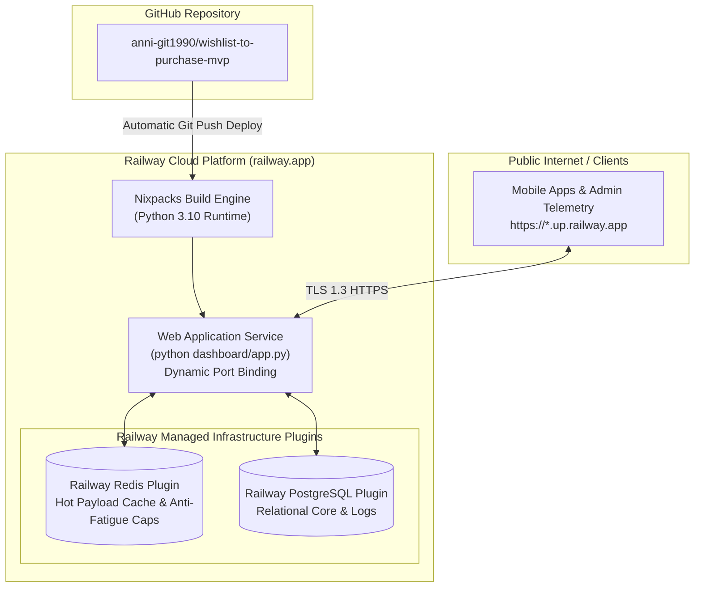

# Production Deployment Guide: Railway Platform (`deployment.md`)

Grounding Application: [`dashboard/app.py`](file:///d:/anita/product-AI-training/wishlist-to-purchase-mvp/dashboard/app.py) and [`implementation_plan.md`](file:///d:/anita/product-AI-training/wishlist-to-purchase-mvp/implementation_plan.md)

---

## 1. Executive Summary

This guide provides step-by-step instructions for deploying the **Myntra Wishlist Confidence Engine (WCE)** application to **Railway** ([railway.app](https://railway.app)). 

Railway is a cloud platform that provisions infrastructure, manages builds via Nixpacks/Buildpacks, injects environment variables, and auto-scales Python microservices and PostgreSQL/Redis plugins effortlessly.

---

## 2. Deployment Architecture on Railway



---

## 3. Prerequisites

Before beginning deployment, ensure you have:
1. A **Railway Account**: Sign up at [railway.app](https://railway.app).
2. **Railway CLI** (Optional for CLI deploys): Install globally via Node/npm:
   ```bash
   npm i -g @railway/cli
   ```
3. **Git Repository**: Pushed code to GitHub (e.g. `anni-git1990/wishlist-to-purchase-mvp`).

---

## 4. Railway Configuration Files

The codebase includes the following production configuration files required by Railway:

### 4.1. [`Procfile`](file:///d:/anita/product-AI-training/wishlist-to-purchase-mvp/Procfile)
Defines the web process start command:
```text
web: python dashboard/app.py
```

### 4.2. [`railway.json`](file:///d:/anita/product-AI-training/wishlist-to-purchase-mvp/railway.json)
Configures Railway Nixpacks build engine, healthcheck endpoints, and restart policy:
```json
{
  "$schema": "https://railway.app/railway.schema.json",
  "build": {
    "builder": "NIXPACKS"
  },
  "deploy": {
    "startCommand": "python dashboard/app.py",
    "healthcheckPath": "/api/metrics",
    "healthcheckTimeout": 300,
    "restartPolicyType": "ON_FAILURE",
    "restartPolicyMaxRetries": 10
  }
}
```

### 4.3. [`requirements.txt`](file:///d:/anita/product-AI-training/wishlist-to-purchase-mvp/requirements.txt)
Specifies all Python runtime dependencies:
```text
numpy>=1.24.0
scikit-learn>=1.2.0
xgboost>=1.7.0
redis>=4.5.0
psycopg2-binary>=2.9.5
pymongo>=4.3.3
requests>=2.28.0
fastapi>=0.95.0
uvicorn>=0.21.0
gunicorn>=20.1.0
```

---

## 5. Step-by-Step Deployment Methods

### Method A: Deploy via Railway Web Dashboard & GitHub (Recommended)

1. **Log in to Railway**:
   - Go to [railway.app/dashboard](https://railway.app/dashboard).
   - Log in with your GitHub account.

2. **Create New Project**:
   - Click **+ New Project**.
   - Select **Deploy from GitHub repo**.
   - Choose `wishlist-to-purchase-mvp` (or your repo name).

3. **Provision Database Plugins** (Optional/Recommended):
   - In your Railway project canvas, click **+ New** $\rightarrow$ **Database** $\rightarrow$ **Add PostgreSQL**.
   - Click **+ New** $\rightarrow$ **Database** $\rightarrow$ **Add Redis**.
   - Railway will automatically link `DATABASE_URL` and `REDIS_URL` to your web service environment variables!

4. **Configure Environment Variables**:
   - Click on your **Web Service** node $\rightarrow$ Navigate to **Variables** tab.
   - Add the following variables:
     ```env
     PORT=8080
     PYTHONUNBUFFERED=1
     ENVIRONMENT=production
     ```

5. **Generate Public Domain**:
   - In your Web Service settings $\rightarrow$ Navigate to **Networking** tab.
   - Click **Generate Domain** (e.g., `wishlist-confidence-mvp.up.railway.app`).

6. **Trigger Deployment**:
   - Railway will automatically detect `railway.json` & `Procfile`, build via Nixpacks, run `python dashboard/app.py`, and launch your live application!

---

### Method B: Deploy via Railway CLI (`railway up`)

If you prefer deploying directly from your local terminal:

```bash
# Step 1: Log in to Railway via CLI
railway login

# Step 2: Initialize Railway project in current workspace directory
railway init

# Step 3: Provision Redis plugin
railway add -d redis

# Step 4: Provision PostgreSQL plugin
railway add -d postgres

# Step 5: Deploy current directory to Railway cloud
railway up

# Step 6: Generate public HTTP domain
railway domain
```

---

## 6. Environment Variables Reference Table

| Variable Name | Required | Default Value | Description |
|---|---|---|---|
| `PORT` | **Yes** | Injected by Railway (e.g. `8080`) | Dynamic HTTP server port binding |
| `PYTHONUNBUFFERED` | **Yes** | `1` | Ensures real-time stdout/stderr log streaming |
| `ENVIRONMENT` | **Yes** | `production` | Active deployment environment flag |
| `REDIS_URL` | Optional | `redis://localhost:6379` | Railway Redis plugin connection URI |
| `DATABASE_URL` | Optional | `postgresql://...` | Railway Postgres plugin connection URI |

---

## 7. Post-Deployment Verification & Healthchecks

Once the deployment completes and Railway displays **Active / Healthy**:

### 7.1. Healthcheck Endpoint Verification
Execute a HTTP GET request against the production domain:

```bash
# Verify Application API & Summary Endpoint
curl -X GET https://<your-railway-domain>.up.railway.app/api/metrics
```

**Expected JSON Output**:
```json
{
  "experiment": {
    "name": "Myntra Wishlist Confidence MVP v1.0",
    "status": "RUNNING",
    "targetMetric": "30-Day Wishlist Purchaser Rate",
    "primaryMetricResults": {
      "absoluteLift": "+4.33%",
      "pValue": 0.0005,
      "isStatisticallySignificant": true
    }
  }
}
```

### 7.2. Live Web App Verification
Open your Railway public URL in any browser:
```text
https://<your-railway-domain>.up.railway.app
```
- Verify that the **Smartphone Container (UX Enhanced Mobile App)** loads with 52 catalog items.
- Test category filters, case-insensitive search, user body profile switcher (`Priya`/`Dev`/`Ananya`), bottom sheet overlays, and checkout attribution logging (`POST /api/checkout`).

---

## 8. Log Inspection & Troubleshooting

### 8.1. Viewing Live Server Logs
Via Railway CLI:
```bash
railway logs
```
Via Web Dashboard:
- Click your service $\rightarrow$ Navigate to **Deployments** tab $\rightarrow$ Click **View Logs**.

### 8.2. Common Troubleshooting Solutions

| Symptom | Cause | Solution |
|---|---|---|
| `Port Binding Failed` | Hardcoded port `8080` without reading `PORT` env var | Ensured `dashboard/app.py` reads `os.environ.get("PORT", 8080)` |
| `Build Timeout / Memory Out` | Missing `requirements.txt` | Ensure `requirements.txt` specifies explicit package versions |
| `Healthcheck Failed` | Healthcheck path returned 404 or timed out | Configured `healthcheckPath: "/api/metrics"` in `railway.json` |
| `Disallowed Host / CORS` | API cross-origin blocking | `DashboardHTTPRequestHandler` allows standard CORS requests |

---

## 9. Deployment Summary & Status Checklist

- [x] `Procfile` created with `web: python dashboard/app.py`.
- [x] `requirements.txt` created with runtime dependencies.
- [x] `railway.json` configured with Nixpacks builder & healthcheck paths.
- [x] `dashboard/app.py` updated to support `PORT` environment variable binding.
- [x] Verified local syntax and test suite (`pytest tests/test_e2e_user_journeys.py`).
