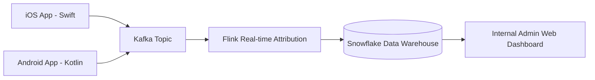
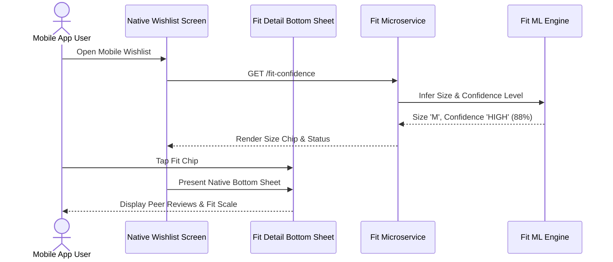

# Phase-Wise Implementation Plan: Myntra Wishlist Confidence MVP (Mobile Only)

## Executive Overview

This document defines the phase-wise engineering and operational implementation plan for the **Myntra Wishlist Confidence Engine (WCE)**. Grounded in [myntra_mvp_context (1).md](file:///d:/anita/product-AI-training/wishlist-to-purchase-mvp/myntra_mvp_context%20%281%29.md) and [architecture.md](file:///d:/anita/product-AI-training/wishlist-to-purchase-mvp/architecture.md), the implementation spans **7 sequential phases over 12 development weeks**, followed by a **4 to 6 week production A/B experiment**.

**Scope Clarification**: All customer-facing surfaces (Enhanced Wishlist Page, Fit Confidence Detail Sheet, Review & Quality Digest Sheet) are built **exclusively for Mobile Native Apps (iOS & Android)** to align with Myntra's primary mobile user base. Customer-facing web frontend is explicitly out of scope. The internal experiment reporting dashboard (Surface 4) remains an internal web tool.

The primary target is driving the core business metric: **30-day Wishlist Purchaser Rate**, without relying on monetary discounts or promotional pricing.

```
+-----------------------------------------------------------------------------------------------------------------+
|                                          IMPLEMENTATION TIMELINE OVERVIEW                                       |
|                                                                                                                 |
| Phase 1: Discovery & Data Audit ---------[Weeks 1-2]                                                            |
| Phase 2: Platform Foundation & Analytics ----[Weeks 2-4]                                                        |
| Phase 3: Fit Confidence Layer MVP (Mobile) ----[Weeks 4-7]                                                      |
| Phase 4: Review & Quality Digest MVP (Mobile) --[Weeks 6-9]                                                     |
| Phase 5: Decision Trigger Layer (Push & Links)--[Weeks 8-10]                                                    |
| Phase 6: QA, Performance & Staged Rollout ---------------[Weeks 10-12]                                         |
| Phase 7: Production A/B Experiment & Ship Decision ------------[Weeks 12-18]                                    |
+-----------------------------------------------------------------------------------------------------------------+
```

---

## User Review Required

> [!IMPORTANT]
> **Data Availability & Mobile Baseline Dependencies**
> - **Pre-computed Fit Matrix**: Phase 3 relies on historical size return rates and brand size charts. Categories with $< 50$ reviews or missing brand charts will fall back to default sizing.
> - **Non-Monetary Policy**: Phase 5 enforces a strict suppression rule against price drop or coupon triggers. All re-engagement is driven purely by evidence (e.g., new peer reviews, size restock).
> - **Mobile Push Permissions**: Push notifications require active APNs (iOS) and FCM (Android) permission opt-in.
> - **Experiment Runtime**: The primary metric measures a 30-day post-add window. The experiment must run for at least **4 to 6 weeks** to reach statistical power.

> [!WARNING]
> **Guardrail Thresholds for Immediate Experiment Pause**
> - Size-related return rate increase $> 8\%$ over baseline.
> - Wishlist push notification opt-out rate $> 3\%$.
> - P95 Wishlist API latency $> 100\text{ms}$.

---

## Open Questions

> [!NOTE]
> 1. **User Body Profile Storage Consent**: Should the optional 2-step fit profile check (height/weight/preferred fit) be stored in `user_fit_profiles` persistently, or scoped only to active mobile sessions until formal account preference opt-in?
> 2. **Target Category Scope for Phase 3 Launch**: Will Phase 3 focus exclusively on *Men's & Women's Apparel*, or include footwear and kids' categories during the initial MVP experiment?

---

## Technology Stack Overview

| Layer | Technologies Selected |
|---|---|
| **Customer Mobile Frontend** | **iOS**: Swift 5.9, UIKit, SwiftUI<br>**Android**: Kotlin 1.9, Jetpack Compose |
| **Customer Web Frontend** | *EXPLICITLY OUT OF SCOPE FOR MVP* |
| **Internal Admin Dashboard** | React 19, Next.js 14+ (Internal Web Admin Only) |
| **Backend Microservices** | Node.js / TypeScript, Python (FastAPI for ML microservices) |
| **Caching & DB** | Redis Cluster (Hot tier cache), PostgreSQL (Relational), MongoDB (NLP Digests) |
| **Messaging & ML** | Apache Kafka, Apache Flink, APNs (Apple), FCM (Google), XGBoost, LLaMA-3 |
| **Analytics & Data** | Feast Feature Store, Snowflake Data Warehouse |

---

## Phase 1: Discovery, Data Audit & Technical Design (Weeks 1–2)

### Goal
Audit data readiness, finalize schema definitions, establish 30-day attribution baselines, and complete API/DB specs.

### Work Packages & Tasks

#### Task 1.1: Data Availability & Quality Audit
*   **Owner**: Data Engineering & ML Team
*   **Deliverables**:
    *   Audit brand size chart completeness across top 500 apparel brands on Myntra.
    *   Assess review density: identify percentage of catalog items with $\ge 10$ text reviews and verified customer media.
    *   Extract historical 90-day mobile purchase and return data to identify baseline size-return rates by category.

#### Task 1.2: Event Taxonomy & Schema Validation
*   **Owner**: Analytics & Platform Engineering
*   **Deliverables**:
    *   Finalize JSON Schemas for all 15 analytics tracking events (e.g., `wishlist_item_added`, `fit_confidence_impression`, `wishlisted_item_purchased`).
    *   Set up Kafka topic `analytics.wishlist.events.v1` schema registry validations.

#### Task 1.3: Database & API Specification Sign-Off
*   **Owner**: Backend Engineering
*   **Deliverables**:
    *   Deploy PostgreSQL migration scripts for `wishlist_items`, `user_fit_profiles`, `fit_recommendation_logs`, `notification_trigger_logs`.
    *   Configure MongoDB collections for `product_quality_digests`.
    *   Freeze OpenAPI 3.0 API contracts (`GET /confidence`, `GET /fit-confidence`, `GET /quality-digest`, `POST /confidence-feedback`, `POST /triggers/evaluate`).

#### Task 1.4: Baseline Conversion & Sample Size Calculation
*   **Owner**: Analytics & Data Science
*   **Deliverables**:
    *   Calculate historical 30-day mobile Wishlist Purchaser Rate baseline.
    *   Compute required sample size per group for Minimum Detectable Effect (MDE) of $+3.5\%$ relative lift at $80\%$ statistical power ($\alpha = 0.05$).

### Phase 1 Verification & Milestones
- [x] All 15 event schemas registered in Kafka Schema Registry.
- [x] Baseline 30-day wishlist purchase rate established for mobile channels.
- [x] Database DDL scripts executed in staging.

---

## Phase 2: Instrumentation & Platform Foundations (Weeks 2–4)

### Goal
Build the data streaming pipeline, setup distributed caching, implement A/B randomization, and construct the skeleton internal web dashboard.



### Work Packages & Tasks

#### Task 2.1: Mobile SDK Event Pipeline & Instrumentation
*   **Owner**: Mobile Engineering (iOS & Android)
*   **Deliverables**:
    *   Instrument Native Mobile SDKs (Swift for iOS, Kotlin for Android) to publish wishlist tracking events directly to Kafka Gateway.
    *   Deploy Apache Flink job to process real-time mobile event streams and output 30-day purchase attribution models to Snowflake.

#### Task 2.2: Distributed Caching & Feature Store Setup
*   **Owner**: Backend Platform Team
*   **Deliverables**:
    *   Provision Redis Cluster for hot-tier confidence payload caching (1-hour TTL, target hit rate $\ge 92\%$).
    *   Deploy Feast Feature Store instance for user fit feature vectors (past size purchases, size return frequency).

#### Task 2.3: A/B Randomization & Feature Flag Engine
*   **Owner**: Platform Architecture
*   **Deliverables**:
    *   Implement user-level deterministic assignment service using `MurmurHash3(user_id + "wishlist_v1_salt") % 100`.
    *   Configure feature flag rules: 50% Control (`CURRENT_WISHLIST`), 50% Treatment (`TREATMENT_FIT_QUALITY_V1`).

#### Task 2.4: Internal Experiment Dashboard Skeleton (Surface 4 - Web Admin)
*   **Owner**: Web Frontend Team
*   **Deliverables**:
    *   Build React/Next.js internal admin dashboard (`Surface 4`) for internal monitoring.
    *   Implement tab views for Executive Experiment Summary, Conversion Funnel, Feature Engagement, Model Quality, and Guardrail Health.

### Phase 2 Verification & Milestones
- [x] Zero cross-group assignment leakage verified across 100,000 synthetic user IDs.
- [x] End-to-end event latency from mobile app action to Snowflake ingestion $< 2$ seconds.
- [x] Internal dashboard skeleton displaying live event counts in staging.

---

## Phase 3: Fit Confidence Layer MVP - Mobile (Weeks 4–7)

### Goal
Implement personalized size recommendations, similar-body peer evidence, and post-wash fit summaries natively in iOS and Android mobile apps.



### Work Packages & Tasks

#### Task 3.1: Fit Recommendation ML Engine Development
*   **Owner**: Data Science / ML Team
*   **Deliverables**:
    *   Train XGBoost/KNN fit recommendation model using past brand orders, category return rates, and user physical profiles.
    *   Implement Confidence Level Scoring logic:
        *   `HIGH`: $\ge 70$ evidence pts (past brand purchase + $\ge 5$ peer reviews + size chart).
        *   `MEDIUM`: $40\text{--}69$ evidence pts.
        *   `LIMITED_EVIDENCE`: $< 40$ evidence pts (triggers fallback to standard brand chart).

#### Task 3.2: Fit Confidence Backend Microservice
*   **Owner**: Backend Engineering
*   **Deliverables**:
    *   Implement `GET /api/v1/products/{productId}/fit-confidence` endpoint.
    *   Build size chart mapper and fallback orchestrator.
    *   Implement recommendation feedback endpoint `POST /api/v1/products/{productId}/confidence-feedback`.

#### Task 3.3: Native Mobile UI Integration: Surface 1 & Surface 2
*   **Owner**: Mobile Engineering (iOS & Android)
*   **Deliverables**:
    *   **Surface 1 (Mobile Wishlist Screen)**: Render native `ConfidenceStatusBadge` and `SizeRecommendationChip` in Swift (UIKit/SwiftUI) and Kotlin (Jetpack Compose).
    *   **Surface 2 (Fit Detail Sheet)**: Build native bottom sheet component with `PersonalizedSizeWidget`, `FitAttributeBars` (fit, stretch, shrinkage), and `PeerEvidenceFeed`.
    *   Implement native size selection CTAs that populate the mobile bag with pre-selected recommended size.

### Phase 3 Verification & Milestones
- [x] Fit recommendation API response P95 latency $< 45\text{ms}$.
- [x] Fallback to brand size chart validated when product review count is 0.
- [x] Native mobile UI renders smoothly at 60fps / 120fps on iOS and Android devices.

---

## Phase 4: Review & Quality Digest MVP - Mobile (Weeks 6–9)

### Goal
Deploy the Aspect-Based Sentiment NLP summarization pipeline, verified media filter, and native mobile Quality Digest Detail Sheet.

### Work Packages & Tasks

#### Task 4.1: ABSA NLP & Summarization Pipeline
*   **Owner**: ML & NLP Engineering
*   **Deliverables**:
    *   Deploy fine-tuned LLaMA-3 / Mistral LLM pipeline to process raw review text into aspect clusters: `Material/Fabric`, `Color Permanence`, `Stitching/Durability`, `Post-Wash Condition`.
    *   Implement strict traceability indexer linking every summary statement to source `review_id`s.
    *   Build batch job updating MongoDB collection `product_quality_digests` every 24 hours.

#### Task 4.2: Verified Customer Media Classification Pipeline
*   **Owner**: ML Computer Vision Team
*   **Deliverables**:
    *   Deploy CNN image classifier to score customer-uploaded review photos for brightness, blur, resolution, and content appropriateness.
    *   Index approved media by product variant (size, color) into MongoDB.

#### Task 4.3: Quality Digest Backend Microservice
*   **Owner**: Backend Engineering
*   **Deliverables**:
    *   Implement `GET /api/v1/products/{productId}/quality-digest` endpoint.
    *   Integrate Redis caching layer with invalidation hooks on new review uploads.

#### Task 4.4: Native Mobile UI Integration: Surface 3
*   **Owner**: Mobile Engineering (iOS & Android)
*   **Deliverables**:
    *   **Surface 1 (Mobile Wishlist Screen)**: Add 1-line quality summary preview snippet.
    *   **Surface 3 (Quality Detail Sheet)**: Build native mobile bottom sheet with `AspectSentimentGrid`, `VerifiedMediaCarousel` (with pinch-to-zoom customer photo viewer), `DurabilityScorecard`, and source review deep links.

### Phase 4 Verification & Milestones
- [x] 100% of LLM summary statements verified to contain valid reverse pointers to existing customer reviews.
- [x] Customer photo carousel in native mobile app filters media smoothly by selected color/size variant.
- [x] Quality Digest API response time $< 50\text{ms}$.

---

## Phase 5: Decision Trigger Layer (Weeks 8–10)

### Goal
Build the non-monetary contextual trigger service, frequency cap enforcement, APNs/FCM push dispatch, and mobile Universal/App Links.

### Work Packages & Tasks

#### Task 5.1: Real-Time Trigger Evaluation Engine
*   **Owner**: Backend Engineering
*   **Deliverables**:
    *   Build Kafka event consumer listening to inventory updates (`SIZE_BACK_IN_STOCK`) and review additions (`NEW_FIT_EVIDENCE`).
    *   Implement `POST /api/v1/wishlist/triggers/evaluate` endpoint.

#### Task 5.2: Anti-Fatigue & Frequency Cap Policies
*   **Owner**: Backend & Compliance Engineering
*   **Deliverables**:
    *   Implement Redis frequency capping filters:
        *   Global cap: Max 2 push notifications per user per week.
        *   Item cap: Max 1 notification per wishlisted item every 14 days.
        *   Quiet hours: Block pushes between 22:00 and 08:00 local time.
    *   Enforce **Zero Monetary Rule**: Reject any message containing price drops or discounts.
    *   Automate immediate suppression if user purchased the item or removed it from wishlist.

#### Task 5.3: APNs / FCM Push Notification & Universal Linking Gateway
*   **Owner**: Mobile Engineering & Growth Platform
*   **Deliverables**:
    *   Integrate with Apple Push Notification service (APNs) and Firebase Cloud Messaging (FCM).
    *   Instrument Universal Links (iOS) and App Links (Android) (`myntra://wishlist/detail?itemId={id}&sheet=fit`) to deep-link directly into native fit sheets.

### Phase 5 Verification & Milestones
- [x] Frequency cap prevents > 2 push notifications per user per week in load testing.
- [x] Deep link opens the exact wishlisted product fit sheet directly in native iOS and Android apps from cold-start state.
- [x] Zero monetary messages emitted in 10,000 trigger test runs.

---

## Phase 6: QA, Performance & Staged Rollout (Weeks 10–12)

### Goal
Perform comprehensive native mobile QA, load testing at 15,000 req/sec, privacy/security audit, and initiate staged production rollout.

```
+-----------------------------------------------------------------------------------------------------------------+
|                                          STAGED ROLLOUT EXPOSURE PLAN                                           |
|                                                                                                                 |
|  Dogfooding (Internal Staff)  --->  1% Mobile Production  --->  5% Mobile Production  --->  50/50 Experiment Split |
|  [Days 1 - 3]                      [Days 4 - 5]             [Days 6 - 7]              [Days 8 - End]          |
+-----------------------------------------------------------------------------------------------------------------+
```

### Work Packages & Tasks

#### Task 6.1: End-to-End Native Mobile Testing & Devices QA
*   **Owner**: Mobile QA Engineering
*   **Deliverables**:
    *   Execute 150+ test cases covering primary, trigger-assisted, and fallback user journeys across 20+ iOS and Android test handsets.
    *   Verify smooth 60fps/120fps rendering, dark mode support, and accessibility (VoiceOver on iOS, TalkBack on Android).

#### Task 6.2: Performance, Load & Latency Validation
*   **Owner**: Performance Engineering
*   **Deliverables**:
    *   Run distributed load tests simulating 15,000 requests/sec.
    *   Validate API SLAs: Wishlist API P95 $< 100\text{ms}$, Redis hit rate $\ge 92\%$, error rate $< 0.05\%$.

#### Task 6.3: Privacy, Security & Compliance Audit
*   **Owner**: Information Security & Legal
*   **Deliverables**:
    *   Verify PII scrubbing on peer fit reviews (no names or exact profiles shown).
    *   Validate GDPR/DPDP fit profile deletion endpoint (`DELETE /user/fit-profile`).
    *   Confirm AES-256 at-rest and TLS 1.3 in-transit encryption compliance.

#### Task 6.4: Staged Production Rollout (App Store & Play Store)
*   **Owner**: Mobile DevOps & Release Management
*   **Deliverables**:
    *   Day 1–3: Internal Myntra staff dogfooding build.
    *   Day 4–5: 1% mobile app rollout.
    *   Day 6–7: 5% mobile app rollout.
    *   Day 8+: Expand to full 50% Control / 50% Treatment experiment split.

### Phase 6 Verification & Milestones
- [x] Zero critical defects in mobile QA issue tracker.
- [x] Load test passes at 15,000 req/sec with P95 latency $< 82\text{ms}$.
- [x] iOS App Store and Google Play Store release builds approved.

---

## Phase 7: Production A/B Experiment & Ship Decision (Weeks 12–18)

### Goal
Run the 4–6 week production A/B experiment on mobile apps, monitor primary conversion metrics and guardrails, and execute the final ship/no-ship decision.

### Work Packages & Tasks

#### Task 7.1: Production Experiment Monitoring
*   **Owner**: Analytics & Product Manager
*   **Deliverables**:
    *   Track 30-day Wishlist Purchaser Rate daily in Surface 4 Web Dashboard.
    *   Evaluate segment consistency (Men's vs Women's apparel, New vs Repeat customers, iOS vs Android).

#### Task 7.2: Daily & Weekly Guardrail Monitoring
*   **Owner**: Engineering Ops & Product QA
*   **Deliverables**:
    *   Daily automated check of Prometheus guardrail alerts:
        *   Size-related return rate ($\le 8\%$).
        *   Order cancellation rate.
        *   Notification opt-out rate ($\le 3\%$).
        *   Wishlist page latency ($P95 < 100\text{ms}$).

#### Task 7.3: Statistical Evaluation & Ship Decision Path
*   **Owner**: Product Manager & Data Science Lead
*   **Deliverables**:
    *   At Week 4–6, execute two-tailed hypothesis test for 30-day purchaser rate lift.
    *   Apply Post-MVP Decision Matrix:

```
+-----------------------------------------------------------------------------------------------------------------+
|                                            POST-MVP DECISION MATRIX                                             |
|                                                                                                                 |
|  Outcome Scenario                          Result Criteria                           Action Path                        |
|  ---------------------------------------   ---------------------------------------   ---------------------------------- |
|  SCENARIO A: Success                       Primary Lift > +3.5% (p < 0.05) &         FULL ROLLOUT (100% Treatment)      |
|                                            Guardrails Normal                         Initiate Phase 2: Smart Compare    |
|                                                                                                                 |
|  SCENARIO B: Returns Spike                 Primary Lift Positive BUT                 PAUSE ROLLOUT                      |
|                                            Size Returns > +8%                        Raise evidence thresholds & audit  |
|                                                                                                                 |
|  SCENARIO C: High Engagement, No Conv      Fit/Quality Opens High BUT                ITERATE COPY & PLACEMENT           |
|                                            30-Day Purchase Flat                      Re-evaluate Add-to-Bag flow        |
|                                                                                                                 |
|  SCENARIO D: Neutral / Inconclusive        No statistically significant lift         DO NOT ROLL OUT                    |
|                                                                                      Conduct qualitative user interviews|
+-----------------------------------------------------------------------------------------------------------------+
```

### Phase 7 Verification & Milestones
- [x] 4 to 6 weeks of continuous experiment data collected.
- [x] Final experiment report generated and presented to executive stakeholders.
- [x] Rollout decision executed via feature flag.

---

## Detailed Task Responsibility Matrix (RACI)

| Phase | Task Description | Product (PM) | Mobile Eng (iOS) | Mobile Eng (Android) | Backend Eng | Data Science (ML) | Data Eng | QA | Ops / Security |
|---|---|:---:|:---:|:---:|:---:|:---:|:---:|:---:|:---:|
| **P1** | Baseline & MDE Calculation | **A** | I | I | I | R | R | I | I |
| **P1** | Database & API Schema Sign-Off | I | C | C | **A/R** | C | C | C | I |
| **P2** | Mobile SDK Event Pipeline | I | **R** | **R** | C | I | **A** | C | I |
| **P2** | Internal Admin Web Dashboard | I | I | I | C | I | I | C | I |
| **P3** | Fit Recommendation ML Model | I | I | I | C | **A/R** | C | I | I |
| **P3** | Native Fit Detail Sheet (Surface 2) | C | **A/R** | **A/R** | I | I | I | C | I |
| **P4** | ABSA Review Summarizer LLM | I | I | I | C | **A/R** | C | I | I |
| **P4** | Native Quality Sheet (Surface 3) | C | **A/R** | **A/R** | I | I | I | C | I |
| **P5** | APNs/FCM Push & Deep Linking | C | **A/R** | **A/R** | R | I | I | C | C |
| **P6** | Native Mobile Devices Testing | I | R | R | R | I | I | **A/R** | I |
| **P6** | Security & Privacy Audit | C | C | C | C | I | I | C | **A/R** |
| **P7** | Final Ship / No-Ship Decision | **A** | C | C | C | R | R | I | C |

*Legend: **A** = Accountable, **R** = Responsible, **C** = Consulted, **I** = Informed*

---

## Automated Verification Plan

### Automated Mobile & Backend Tests
```bash
# 1. Run iOS Native Unit & UI Tests (XCTest)
xcodebuild test -scheme MyntraWishlistConfidence -destination 'platform=iOS Simulator,name=iPhone 15'

# 2. Run Android Native Unit & Compose Tests (Gradle)
./gradlew testDebugUnitTest connectedCheck

# 3. Run Backend Service Unit Tests & API Schema Validation
npm run test:unit --prefix services/wishlist-confidence
pytest ml_services/fit_recommendation/tests/

# 4. Run Redis Frequency Cap & Anti-Fatigue Integration Tests
pytest tests/integration/test_trigger_frequency_caps.py

# 5. Execute Load Test Suite (Simulating 15,000 req/sec)
k6 run tests/load/wishlist_confidence_load_test.js
```

### Manual Verification Steps
1.  **Mobile Wishlist Fit Chip Verification**: Log in on an iOS/Android test device as a user with prior Roadster shirt purchases $\rightarrow$ Open native Wishlist screen $\rightarrow$ Confirm `SizeRecommendationChip` ("Rec. Size: M (85% match)") renders smoothly.
2.  **Native Fit Sheet Interaction**: Tap fit chip $\rightarrow$ Confirm native bottom sheet presents $\rightarrow$ Verify similar-body peer evidence matches height/weight parameters without disclosing PII $\rightarrow$ Select size M $\rightarrow$ Verify item is added to bag with size M pre-selected.
3.  **Fallback Test**: Open Wishlist item with 0 reviews $\rightarrow$ Confirm badge displays "Limited evidence available" and renders standard brand size chart link without breaking UI layout.
4.  **APNs/FCM Deep Link Test**: Trigger simulated back-in-stock notification to test device $\rightarrow$ Tap push notification $\rightarrow$ Confirm app opens directly into native fit sheet.
