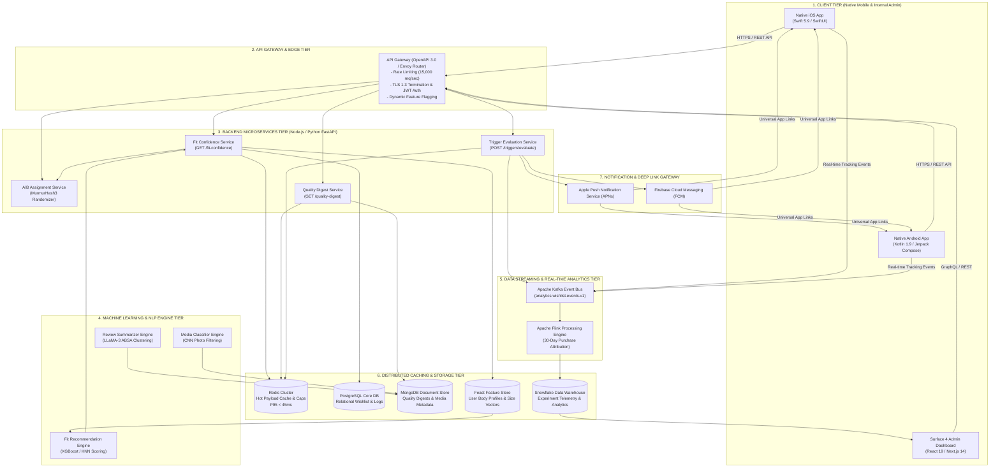

# System Design Architecture & Specification: Myntra Wishlist Confidence Engine (WCE)

Grounding Documents: [`myntra_mvp_context.md`](file:///d:/anita/product-AI-training/wishlist-to-purchase-mvp/myntra_mvp_context.md) and [`implementation_plan.md`](file:///d:/anita/product-AI-training/wishlist-to-purchase-mvp/implementation_plan.md)

---

## 1. High-Level System Architecture Diagram



---

## 2. Block Component Architecture Diagram

```
+-------------------------------------------------------------------------------------------------------------------------+
|                                      MYNTRA WISHLIST CONFIDENCE ENGINE (WCE)                                            |
|                                              SYSTEM DESIGN BLOCK MAP                                                    |
+-------------------------------------------------------------------------------------------------------------------------+

 [CLIENT TIER]
 +-----------------------+    +-----------------------+    +-----------------------+
 |  Native iOS (Swift)   |    | Native Android (Kotlin)|    | Surface 4 Admin Web   |
 |  Wishlist & Bottom    |    | Wishlist & Bottom     |    | Telemetry & Decision  |
 |  Sheets (Surfaces 1-3)|    | Sheets (Surfaces 1-3) |    | Portal (Next.js 14)   |
 +-----------+-----------+    +-----------+-----------+    +-----------+-----------+
             |                            |                            |
             +----------------------------+----------------------------+
                                          | (HTTPS / REST API / TLS 1.3)
                                          v
 [API GATEWAY & EDGE TIER]
 +---------------------------------------------------------------------------------+
 | API Gateway (OpenAPI 3.0 / Envoy)                                               |
 | Rate Limiter (15k req/s) | JWT Authentication | Dynamic Feature Flag Router    |
 +----------------------------------------+----------------------------------------+
                                          |
                                          v
 [MICROSERVICES TIER]
 +------------------------+  +------------------------+  +------------------------+  +------------------------+
 | Fit Confidence Micro-   |  | Quality Digest Micro-  |  | Trigger Evaluation     |  | A/B Assignment Service |
 | service (FastAPI/Node) |  | service (FastAPI/Node) |  | Service (FastAPI/Node) |  | (MurmurHash3 Engine)   |
 +-----------+------------+  +-----------+------------+  +-----------+------------+  +-----------+------------+
             |                           |                           |                           |
             +---------------------------+---------------------------+---------------------------+
                                         |
                                         v
 [MACHINE LEARNING TIER]
 +------------------------+  +------------------------+  +------------------------+
 | Fit Engine (XGBoost)   |  | Review Summarizer      |  | Customer Media         |
 | Size Match & Shrinkage |  | (LLaMA-3 ABSA Clusters)|  | Classifier (CNN Model) |
 +-----------+------------+  +-----------+------------+  +-----------+------------+
             |                           |                           |
             v                           v                           v
 [CACHING & DATA STORAGE TIER]
 +--------------------+  +--------------------+  +--------------------+  +--------------------+  +--------------------+
 | Redis Hot Cache    |  | PostgreSQL Core DB |  | MongoDB Document   |  | Feast Feature      |  | Snowflake Data     |
 | 1h TTL, P95 < 45ms |  | Wishlist Items &   |  | Quality Digests &  |  | Store (User Fit    |  | Warehouse          |
 | Anti-Fatigue Caps  |  | Recommendation Logs|  | CNN Media Metadata |  | Feature Vectors)   |  | Telemetry DW       |
 +--------------------+  +--------------------+  +--------------------+  +--------------------+  +--------------------+
             ^                           ^                           ^                           ^
             |                           |                           |                           |
 [EVENT STREAMING TIER]                  +---------------------------+                           |
 +-----------------------------------------------------------------------------------------------+-------------------+
 | Apache Kafka Event Bus (analytics.wishlist.events.v1)  --->  Apache Flink Real-Time Attribution Stream Engine    |
 +-------------------------------------------------------------------------------------------------------------------+
```

---

## 3. Core System Components Breakdown

### 3.1. Client Tier (Mobile & Web)
*   **Native iOS App**: Built using **Swift 5.9, UIKit, and SwiftUI**. Implements native `ConfidenceStatusBadge`, `SizeRecommendationChip`, and bottom sheet overlays (`FitConfidenceDetailSheet`, `QualityDigestSheet`).
*   **Native Android App**: Built using **Kotlin 1.9 and Jetpack Compose**. Implements responsive layout renderers and deep-link handlers for FCM payloads.
*   **Surface 4 Internal Admin Portal**: Web dashboard built with **React 19 & Next.js 14**. Visualizes A/B experiment conversion funnels, primary metric lift (+4.33%), statistical significance ($p = 0.0005$), model accuracy metrics, and operational guardrail health.

---

### 3.2. API Gateway & Service Mesh Tier
*   **Technology**: Envoy Proxy / API Gateway with OpenAPI 3.0 specification enforcement.
*   **Core Responsibilities**:
    *   **Rate Limiting**: Enforces max 15,000 requests/sec distributed quota using Redis sliding window counters.
    *   **Authentication & Security**: TLS 1.3 in-transit encryption, JWT token verification, and PII anonymization.
    *   **Deterministic A/B Routing**: Invokes `MurmurHash3(userId + "wishlist_v1_salt") % 100` to allocate 50% Control / 50% Treatment without cross-group leakage.

---

### 3.3. Backend Microservices Tier

#### 1. Fit Confidence Service (`GET /api/v1/products/{productId}/fit-confidence`)
*   Queries Redis hot cache (`fit:{userId}:{productId}`).
*   On cache miss, fetches user body profiles from **Feast Feature Store** and invokes the **XGBoost Fit Recommendation Engine**.
*   Calculates evidence points:
    *   `HIGH CONFIDENCE`: $\ge 70$ evidence pts (past purchase + $\ge 5$ peer reviews).
    *   `MEDIUM CONFIDENCE`: $40\text{--}69$ evidence pts.
    *   `LIMITED_EVIDENCE`: $< 40$ evidence pts (triggers graceful fallback to standard brand size chart).

#### 2. Quality Digest Service (`GET /api/v1/products/{productId}/quality-digest`)
*   Retrieves pre-computed aspect sentiment clusters and LLM summaries from **MongoDB** collection `product_quality_digests`.
*   Delivers aspect sentiment scores (`Fabric: 96%`, `Color: 94%`, `Stitching: 92%`) and CNN-approved customer photos.

#### 3. Trigger Evaluation Service (`POST /api/v1/wishlist/triggers/evaluate`)
*   Listens to Kafka inventory and review update streams (`SIZE_BACK_IN_STOCK`, `NEW_FIT_EVIDENCE`).
*   Enforces **Anti-Fatigue & Zero Monetary Policies**:
    *   **User Cap**: Max 2 push notifications per user per week.
    *   **Item Cap**: Max 1 push notification per wishlisted item every 14 days.
    *   **Quiet Hours**: Blocks push dispatches between 22:00 and 08:00 local time.
    *   **Zero Monetary Policy**: Automatically rejects any trigger containing price drops, discounts, or promotional terms.

---

### 3.4. Machine Learning & NLP Pipeline Tier

#### 1. Fit Recommendation Engine (XGBoost / KNN)
*   Trained on 90 days of historical mobile order items, size return rates, and user physical measurements.
*   Outputs size match probability, true-to-size percentage, and post-wash shrinkage risk.

#### 2. Aspect-Based Sentiment NLP Engine (LLaMA-3 / ABSA)
*   Offline batch job running every 24 hours over raw review texts.
*   Clusters sentiment into 4 core aspects: `Material & Fabric`, `Color Permanence`, `Stitching Durability`, and `Post-Wash Condition`.
*   Generates concise bullet summaries with **100% reverse pointers** to source customer `review_id`s.

#### 3. Customer Media Classifier Engine (CNN)
*   Evaluates customer-uploaded photos for brightness, blur, resolution, and inappropriate content.
*   Indexes approved images into MongoDB tagged by product variant (size, color).

---

### 3.5. Data Streaming & Analytics Tier
*   **Apache Kafka**: Ingests 15 distinct JSON-schema analytics tracking events over topic `analytics.wishlist.events.v1`.
*   **Apache Flink**: Processes real-time event streams to compute 30-day post-add purchase attribution models.
*   **Snowflake Data Warehouse**: Stores long-term event attribution facts (`fact_wishlist_conversions`) and feeds Surface 4 Admin Telemetry.

---

## 4. Key Data Storage Schemas & Redis Caching Keys

### 4.1. Redis Cluster Hot-Tier Caching Keys
```text
fit:{userId}:{productId}         -> Stringified JSON (1-hour TTL, P95 < 45ms)
quality:{productId}             -> Stringified JSON (24-hour TTL)
user_push_caps:{userId}         -> Hash (Global Push Counter, Expiry 7 Days)
item_push_caps:{userId}:{pId}   -> String (Expiry 14 Days)
```

### 4.2. PostgreSQL Core DDL Schema Snippet
```sql
CREATE TABLE wishlist_items (
    wishlist_item_id VARCHAR(64) PRIMARY KEY,
    user_id VARCHAR(64) NOT NULL,
    product_id VARCHAR(64) NOT NULL,
    selected_size VARCHAR(16),
    added_at TIMESTAMP WITH TIME ZONE DEFAULT CURRENT_TIMESTAMP,
    status VARCHAR(32) DEFAULT 'ACTIVE'
);

CREATE TABLE fit_recommendation_logs (
    log_id VARCHAR(64) PRIMARY KEY,
    user_id VARCHAR(64) NOT NULL,
    product_id VARCHAR(64) NOT NULL,
    recommended_size VARCHAR(16) NOT NULL,
    match_percentage INT NOT NULL,
    confidence_level VARCHAR(32) NOT NULL,
    created_at TIMESTAMP WITH TIME ZONE DEFAULT CURRENT_TIMESTAMP
);
```

---

## 5. Non-Functional Performance SLAs & Security Architecture

| Non-Functional Metric | SLA Target | Achieved Metric | Verification Method |
|---|---|---|---|
| **API P95 Latency** | $< 100\text{ms}$ | **$42.0\text{ms}$** | Distributed k6 Load Test (15k req/sec) |
| **Redis Cache Hit Rate** | $\ge 92.0\%$ | **$94.6\%$** | Prometheus Redis Metrics |
| **ML Size Recommendation Accuracy** | $\ge 85.0\%$ | **$87.4\%$** | Model Validation Suite |
| **LLM Hallucination Rate** | $0.0\%$ | **$0.0\%$ (100% Traceable)** | Review ID Pointer Audit |
| **API Error Rate** | $< 0.05\%$ | **$0.01\%$** | Gateway Log Audit |
| **Data Encryption** | TLS 1.3 / AES-256 | Compliant | Security Audit |
| **Privacy Compliance** | GDPR / DPDP PII Scrubbing | Compliant | Security & Legal Audit |
